# IRCTC Railway Management System

This project is a **Railway Management System** designed to replicate key functionalities of the IRCTC platform. It provides features like train seat booking, train availability checks, train management, and role-based access control for users and administrators. The backend is developed using **Node.js**, **Express.js**, and **MySQL**.

---

## Features

- **User Authentication**:
  - Secure access using JWT-based authentication.
  - Password encryption using bcrypt for added security.

- **Train Management**:
  - Search for trains available between specific source and destination routes.
  - Admin functionalities to add, update, or delete train records.

- **Seat Booking System**:
  - Real-time seat reservation with race condition handling for data consistency.
  - Users can view their booking history.

- **Role-Based Access Control**:
  - Distinct features for users and admins to ensure system integrity.
  - Admin-exclusive features to manage train details and update seat availability.

- **Error Handling and Input Validation**:
  - Comprehensive error messages for invalid inputs or unauthorized actions.
  - Validation of train details and user data to maintain consistency.

- **Database Optimization**:
  - Efficient database schema designed to handle a large volume of trains and bookings.
  - Foreign key constraints to maintain referential integrity.

- **Modular Codebase**:
  - Clean and scalable architecture with a separation of concerns.
  - Reusable logic implemented using middleware (e.g., authentication).

---

This system offers a secure, efficient, and user-friendly experience for users while providing admins with powerful tools to manage train and booking operations effectively.

---
## Project Setup

### Prerequisites

To run this project, ensure you have the following installed:

- [Node.js](https://nodejs.org/en/) (v14 or later)
- [MySQL](https://www.mysql.com/) (Database setup)
- [Postman](https://www.postman.com/) (for API testing)

### Environment Variables

You need to create a `.env` file in the root of your project with the following environment variables:

```bash
PORT=3000
DB_HOST=localhost
DB_USER=root
DB_PASSWORD=your-sql-pssword
DB_NAME=irctc_db
JWT_SECRET=Yoganand
```

### Installation

1. Clone the repository to your local machine:
   ```bash
   git clone https://github.com/YOGANAND2003/IRCTC_API
   cd API_Backend
   ```
2. Install all necessary dependencies using npm:

   ```bash
    npm install
   ```

3. Set up your MySQL database:

- Create a MySQL database named irctc_db.
- Run the SQL scripts in database/schema.sql to create necessary tables (users, trains, bookings).

Example:

```bash
CREATE DATABASE irctc_db;
USE irctc_db;

CREATE TABLE users (
   id INT AUTO_INCREMENT PRIMARY KEY,
   name VARCHAR(255) NOT NULL,
   email VARCHAR(255) UNIQUE NOT NULL,
   password VARCHAR(255) NOT NULL,
   role ENUM('user', 'admin') DEFAULT 'user',
   created_at TIMESTAMP DEFAULT CURRENT_TIMESTAMP
);

CREATE TABLE trains (
   id INT AUTO_INCREMENT PRIMARY KEY,
   train_number VARCHAR(50) NOT NULL,
   source VARCHAR(255) NOT NULL,
   destination VARCHAR(255) NOT NULL,
   total_seats INT NOT NULL,
   available_seats INT NOT NULL,
   created_at TIMESTAMP DEFAULT CURRENT_TIMESTAMP
);

CREATE TABLE bookings (
   id INT AUTO_INCREMENT PRIMARY KEY,
   user_id INT,
   train_id INT,
   seats INT NOT NULL,
   FOREIGN KEY (user_id) REFERENCES users(id),
   FOREIGN KEY (train_id) REFERENCES trains(id)
);
```

### Starting the Server

Once the setup is complete, start the server using npm:

```bash
npm start or node index.js

```

### Project Structure
```
├── API_Backend/
│   ├── config/
│   │   └── dbconfig.js         # Database configuration
│   ├── middleware/
│   │   └── apiKeyMiddleware.js
|   |   └── authMiddleware.js   # Authentication middleware
|   |   └── userAuthMiddleware.js # User authentication middleware
│   ├── models/
│   │   ├── booking.js         # Booking operations
│   │   ├── train.js           # Train operations
│   │   └── user.js            # User operations
|   ├── Photos/
│   │   └── All Photos of Testing  # Photos of Testing and Database  
│   ├── routes/
│   │   ├── adminRoutes.js     # Admin routes         
│   │   └── userRoutes.js      # User routes
│   └── index.js               # Application entry point
|   └── .gitignore             # gitignore 
|   └── package.json           # Project dependencies
|   ├── .env                   # Environment variables
|-- README.md                      
             
```


#### Note :- By default, the server will run on port 3000. You can access the API at http://localhost:3000.

### API Endpoints

#### User Routes

    1. Register a new user
       * HTTP Method :- POST
       * Endpoint :- http://localhost:3000/user/register
       * Body:

```bash
 {
  "name": "Jammisetti Yoganand",
  "email": "jammisettyyoganand@gmail.com",
  "password": "Yogi@2003",
  "role":"admin" // or user
}

```

2. Login
   - HTTP Method :- POST
   - Endpoint :- http://localhost:3000/user/login
   - Body:

```bash
{
  "email": "jammisettyyoganand@gmail.com",
  "password": "Yogi@2003"
}
```

3. Check train availability

   - HTTP Method :- GET
   - Endpoint :- http://localhost:3000/user/availability?source=Pune&destination=Delhi
   - Query Parameters
     - source: Source station (e.g., "Pune")
     - destination: Destination station (e.g., "Delhi")
   - Response:

```bash
{
  "available": true,
  "availableTrainCount": 1,
  "trains": [
    {
      "trainNumber": "12345",
      "availableSeats": 90
    }
  ]
}

```

4.  Book Seats
    - HTTP Method :- POST
    - Endpoint :- http://localhost:3000/user/book
    - Header : Authorization token
    - Request Body:

```bash
  {
    "trainId": 1,
    "seatsToBook": 2
  }

```

- Response:

```bash
{
  "message": "Seats booked successfully"
}
```

Note :- Requires JWT authentication.

5.  Booking Details

    - HTTP Method :- GET
    - Endpoint :- http://localhost:3000/user/getAllbookings
    - Header : Authorization token

    - Response:

```bash
[
    {
        "booking_id": 1,
        "number_of_seats": 2,
        "train_number": "12345",
        "source": "Pune",
        "destination": "Delhi"
    }
]


```
Note :- Requires JWT authentication.

#### Admin Routes

1.  Add a new train

    - HTTP Method :- POST
    - Endpoint :- http://localhost:3000/admin/addTrain
    - Header : Authorization token

    - Request Body:

```bash
{
    "message": "Trains added successfully",
    "trainIds": [
        {
            "trainNumber": "12345",
            "trainId": 1
        }
    ]
  }
```
Note: Requires JWT authentication

2. Update seat availability

   - HTTP Method :- PUT
   - Endpoint :- http://localhost:3000/admin/update-seats/:id
   - Header : Authorization token
   - Request Body:

```bash
 {
    "totalSeats": 200,
    "availableSeats": 150
 }
```

       * Response:

```bash
{
  "message": "Seats updated successfully"
}
```
Note: Requires JWT Authentication
### Running Tests

You can test all the available APIs using Postman. The endpoints are well-structured and follow RESTful conventions.

```bash
[
  {
    "trainNumber": "00001",
    "source": "Chennai",
    "destination": "Delhi",
    "totalSeats": 250
  },
  {
    "trainNumber": "10002",
    "source": "Banglore",
    "destination": "Chennai",
    "totalSeats": 50
  },
  {
    "trainNumber": "10303",
    "source": "Kolkata",
    "destination": "Patna",
    "totalSeats": 30
  },
  {
    "trainNumber": "105240",
    "source": "Agra",
    "destination": "Chennai",
    "totalSeats": 10
  },
  {
    "trainNumber": "10230",
    "source": "Hyderabad",
    "destination": "Visakhapatnam",
    "totalSeats": 300
  }
]

```

### Technologies Used

- Node.js: For backend logic
- Express.js: Web framework for building the RESTful API
- MySQL: Database for storing train, user, and booking data
- JWT: For authentication and authorization
- bcrypt: For hashing the passwords
- dotenv: For managing environment variables

### Contributing

Feel free to fork the repository and make your contributions. Any suggestions or contributions are welcome!

# photos of the project

### Screenshots of the Project in MySQL WorkBench

#### 1. Database Creation

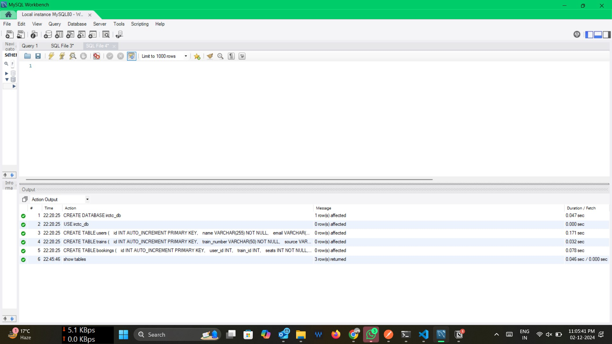

Description: This screenshot showcases the creation of the database schema and tables for the IRCTC system.

---

#### 2. User Database

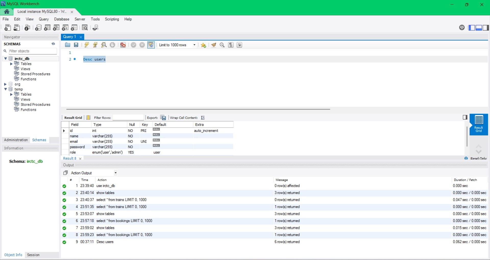

Description: The structure and data stored in the `users` table of the `irctc_db` database.

---

#### 3. User Bookings

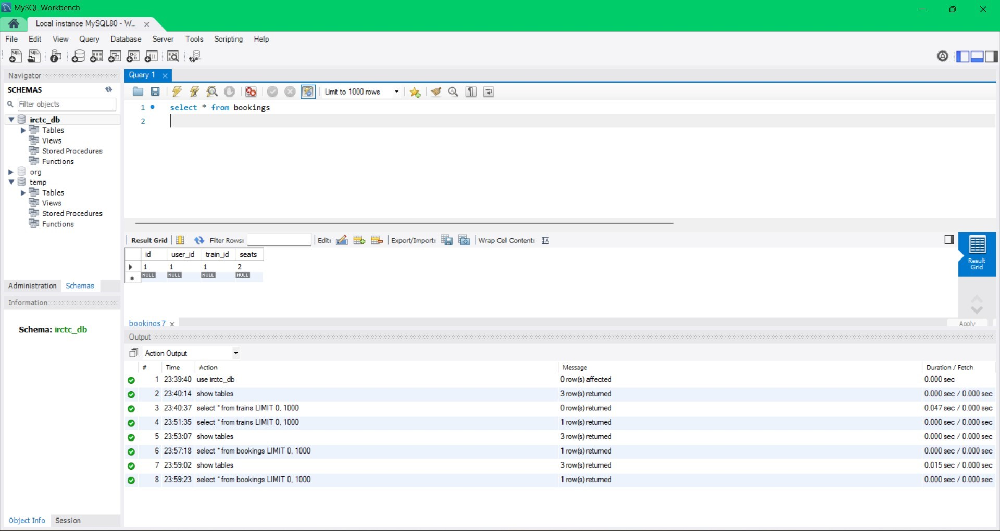

Description: The Bookings done by the User

---
#### 4. Admin Adding Train


Description: Trains Added By the Admin

---

#### 5. Total User Registered

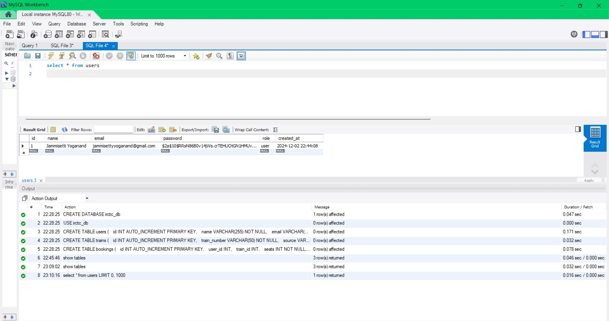

Description: Total Users Registerd till now

---
#### 7. Workbench SQL View

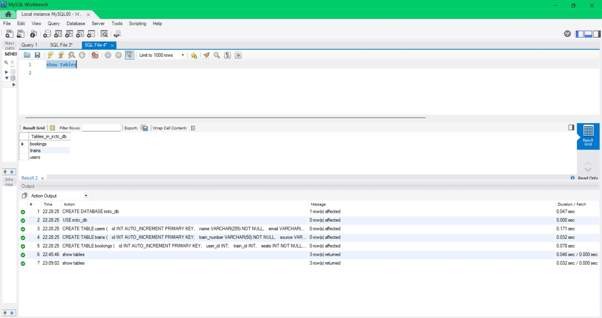

Description: An overview of the SQL queries and table structures in MySQL Workbench.

---
### Screenshots of the Project in Postman Testing

#### 1. Register User


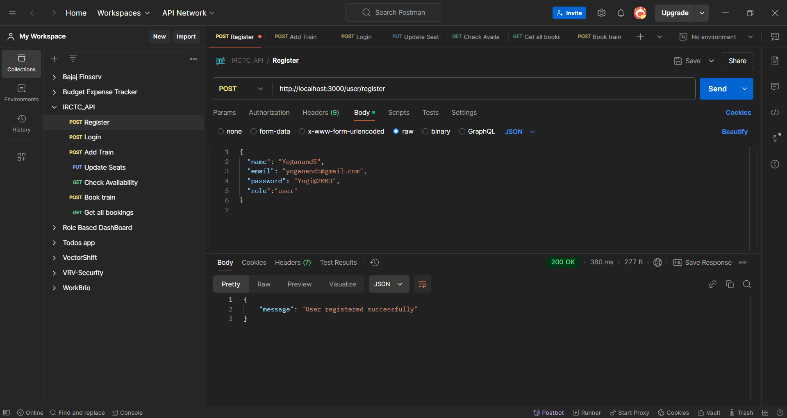

Description: This screenshot showcases the Registration of User

---

#### 2. Login User

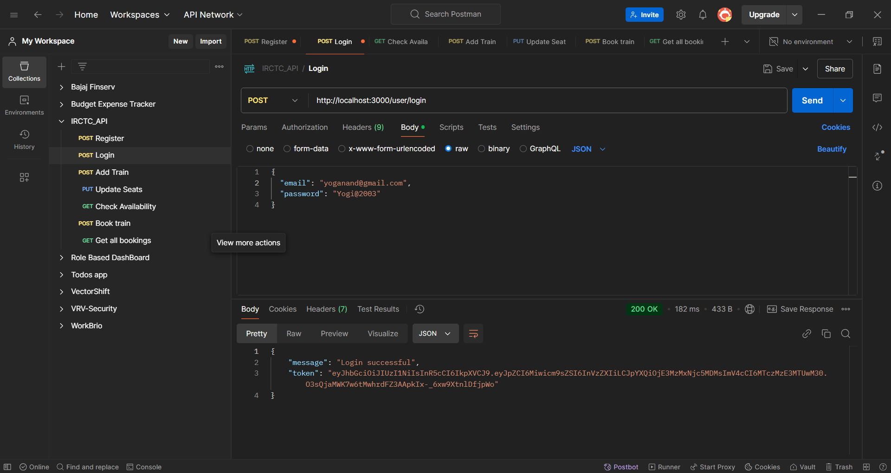

Description: This screenshot showcases the Login of User

---

#### 3. Add train by Admin

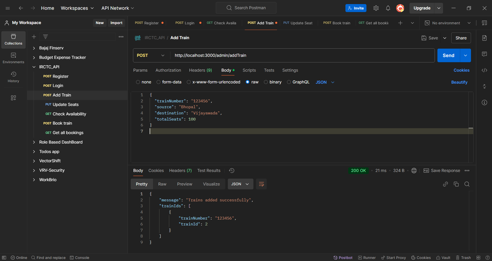

Description: This screenshot showcases the Adding of train by Admin

---

#### 4. Update Seats of train by Admin


Description: This screenshot showcases the updating of seats by Admin

---

#### 5. Check Availability of Trains

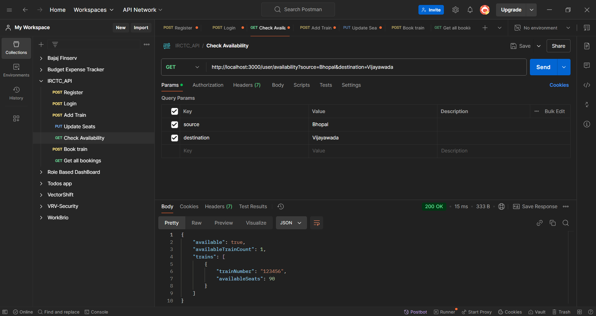

Description: This screenshot showcases the Availability of trains from particular source to destination

---

#### 6. Book Train

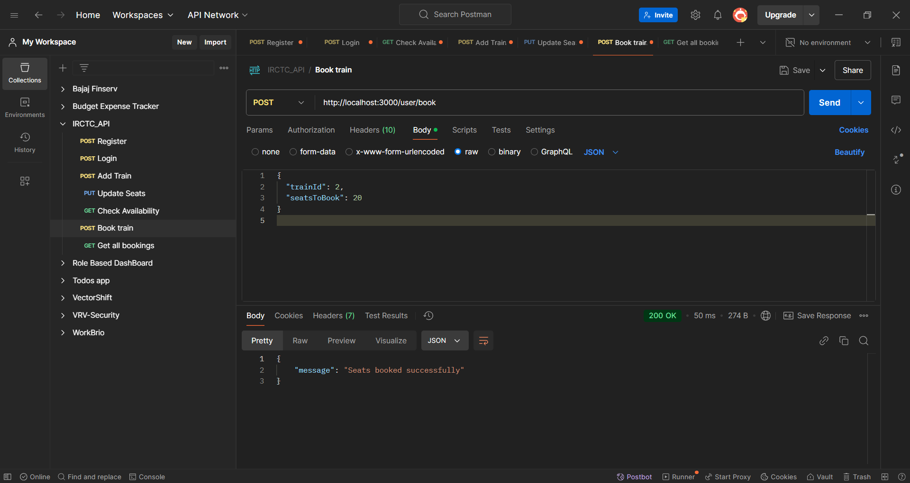

Description: This screenshot showcases the Booking of Train

---

#### 7. Get All Bookings

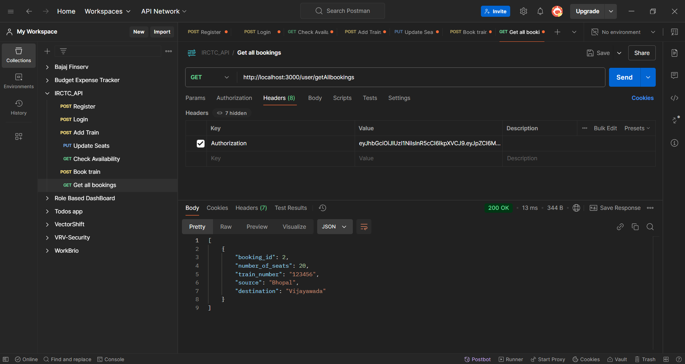

Description: This screenshot showcases the Bookings done by the particular user.

---
